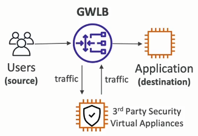

# Elastic Load Balancer (ELB)

Load Balancers are servers that forward internet traffic to multiple servers (EC2 instances) downstream.

Why use a Load Balancer ?

- spread load across multiple downstream instance
- expose a single point of access (DNS) to your application
- seamlessly hadle failures of downstream instances
- do regular health checks to you instances
- provide SSL termination (HTTPS) for your webistes
- high availability across zones

An ELB (Elastic Load Balancer) is a **managed load balancer**:
- AWS guarantees that it will be working
- AWS takes care of upgrades, maintenance, high availability
- AWS provides only a few configuration knobs

It costs less to setup your own load balancer, but it will be a lot more effort on you end (maintenance, integrations).

There are 4 kinds of load balancer offered by AWS:
- Application Load Balancer (HTTP/HTTPS/gRPC only) - Layer 7
- Network Load Balancer (ultra-high performance, allows for TCP) - Layer 4
- Gateway Load Balancer - Layer 3
- Classic Load Balancer (retired in 2023) - Layer 4 & 7

## Application Load Balancer (ALB)

- HTTP/HTTPS/gRPC procotols (Layer 7)
- HTTP routing features
- Static DNS (URL)

## Network Load Balancer (NLB)

- TCP/UDP protocols (Layer 4)
- High Performance: millions of requests per seconds
- Static IP through Elastic IP

## Gateway Load Balancer (GWLB)

- GENEVE Protocol on IP Packets (Layer 3)
- Route Traffic to Firewall that you manage on EC2 instances
- Intrusion Detection or Deep Packet Inspection

So the Gateway Load Balancer doesn't balance the load to your application. It actually balances the load of the traffic to the virtual appliances that you run on EC2 instances so that you can analyze the traffic or perform firewall operations. That's why it's called **3rd Party Security Virtual Appliances**.

