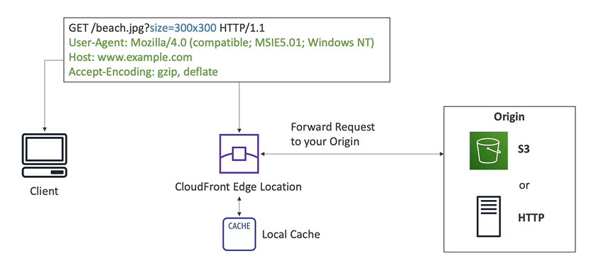

# CloudFront

- CloudFront is **Content Delivery Network (CDN)**
- CloudFront is a **Global Service**
- It improves read performances because content is **cached at the edge locations**
- It improves user experience (lower latency)
- 216 Point of Presence (Edge Locations)
- DDoS protection (because worldwide), integration with Shield and WAF (Web Application Firewall)

## CloudFront Origins

- **S3 Bucket**
    - For distributing files and caching them at the edge
    - Enhanced security with CloudFront **Origin Access Control (OAC)**
        - OAC is replacing Origin Access Identity (OAI)
    - CloudFront can be used as an ingress (to upload file on S3)
- **Custom Origin (HTTP)**
    - Application Load Balancer
    - EC2 instance
    - S3 website (must first enable the bucket as a static S3 website)
    - Any HTTP backend you want

## CloudFront: S3 as an Origin

Using CloudFront and the edge locations, we can see that the content of our S3 bucket in **one region** can be distributed all around the world through the edge locations or points of presence.

## CloudFront vs S3 Cross Region Replication

- CloudFront
    - Global Edge Network (216 points of presence)
    - Files are cached for a TTL (maybe a day)
    - Great for static content that must be available everywhere

- S3 Cross Region Replication
    - Must be setup for each region you want replication to happen
    - Files are updated in near real-time (no caching)
    - Read only
    - Great for dynamic content thats needs to be available at low latency in few regions