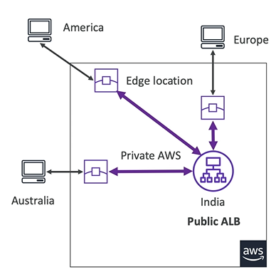
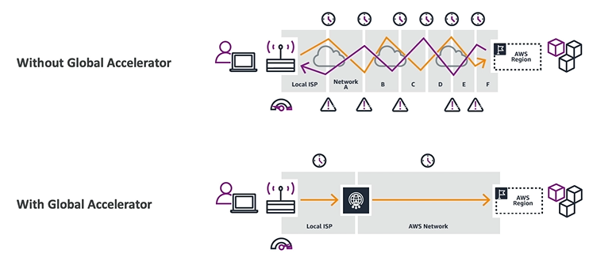

 # Global Accelerator Basics

 - AWS Global Accelerator improves global application **availability** and **performance** using the AWS global network

 - AWS Global Accelerator leverages the AWS internal network to optimize the route to your application (60% improvement)

 - **2 Anycast IP** are created for your application and traffic is sent through Edge Locations

 - The Edge Locations send the traffic to your application

 

 

 ## Global Accelerator vs CloudFront

 They both use the AWS Global Network and its edge location around the world.

 They both integrate with AWS Shield for DDoS protection.

**CloudFront**
- Content Delivery Network (CDN)
- Improves performances for your cacheable content
- Content is **served at the edge**

**Global Accelerator**
- No caching, proxying packets at the edge to applications running in one or more AWS regions
- Improves performance for a wide range of applications over TCP and UDP
- Good for HTTP use cases that require static IP addresses
- Good for HTTP use cases that require deterministic, fast regional failover