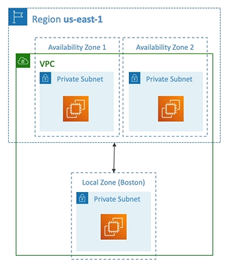

# AWS Local Zones

- Place AWS compute, storage, database and other selected AWS services **closer to end users to run latency-sensitive applications**
- Extend your VPC to more locations (extensions of an AWS Region)

## Example

- AWS Region: North Virginia (us-east-1) 
- AWS Availability Zones: 6 by default
- AWS Local Zones: Boston, Chicago, Dallas, Houston, Miami, etc.

