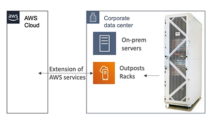

# Outposts

Hybrid Cloud is when business keeps an on-premises infrastructure alongside a cloud infrastructure.

Two ways of dealing with IT systems:
- One for the AWS Cloud (using the AWS console, AWS CLI and AWS APIs)
- One for their on-premises infrastructure

**AWS Outposts are "server racks"** that offers the same AWS infrastructure, services, APIs & tools to build your own application on-premises just as in the cloud.

AWS will setup and manage "Outposts Racks" within your on-premises infrastructure and you can start leveraging AWS services on-premises.

You are responsibile for the Outposts Racks physical security because that rack is in your data center.

## Benefits of AWS Outposts

- Low-latency access to on-premises systems
- Local data processing (data never leave your data center)
- Data residency
- Easier migration from on-premises to the cloud
- Fully managed service
- Services:
    - Amazon EC2
    - Amazon EBS
    - Amazon S3
    - Amazon EKS
    - Amazon ECS
    - Amazon RDS
    - Amazon EMR

