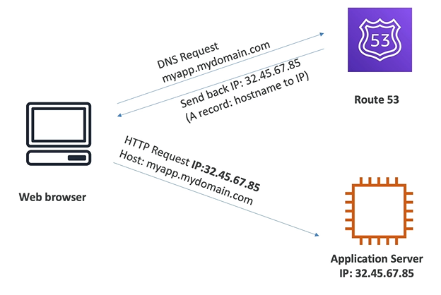
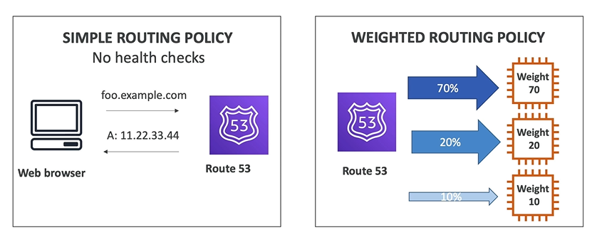
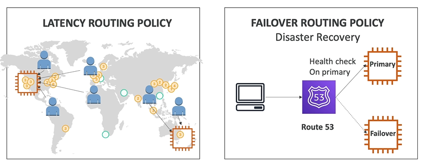

# Route 53 Basics

**Route 53** is a managed DNS (Domain Name System).

Route 53 features are (non exhaustive list): 
- DNS
- Domain Registration
- Health Checks
- Routing Policy

A DNS is a collection of rules and records which helps clients understand how to reach the server through URLs.

In AWS the most common records are:
- www.google.com => 12.34.56.78 == **A Record** (IPv4)
- www.google.com => 2001:0db8:85a3:0000:0000:8a2e:0370:7334 == **AAAA Record** (IPv6)
- search.google.com => www.google.com == **CNAME** (hostname to hostname)
- example.com => AWS resource == **Alias** (e.g. ELB, CloudFront, S3, etc.)

## Diagram for A Record

## Route 53 Routing Policies

