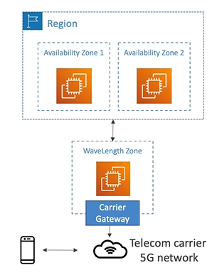

# AWS WaveLength Basics

- **WaveLength Zones** are infrastructure deployments embedded within the telecommunications providers datacenters at the edge of 5G networks

- Bring AWS Services to the edge of the 5G networks

- Ultra-low latency applications through 5G networks

- Traffic doesn't leave the Communication Service Provider (CSP) network (it actually never reaches AWS)

- High-bandwidth and secure connection to the parent AWS region

- No additional charges or service agreements 

- Use Cases
    - Smart Cities
    - ML-assisted diagnostics
    - Connected Vehicles
    - Interactive Live Video Streams
    - AR/VR
    - Real-time Gaming
    - **Anything that requires really low latency and to be very close at the edge to your users**
    
