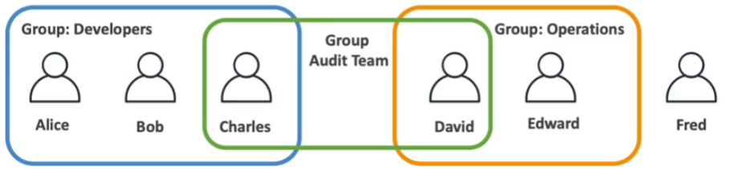
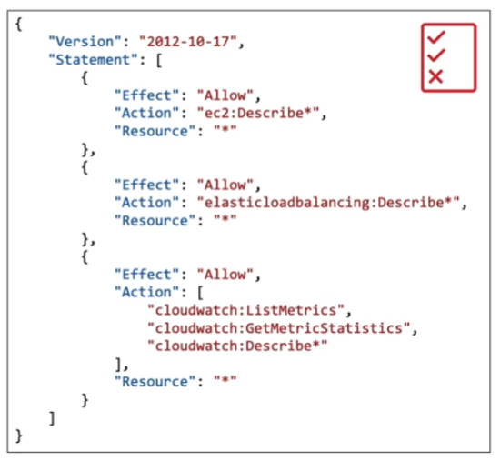

## IAM Introduction

Identity and Access Management (IAM) is a **global service**. There is no region to be selected. When you create a user in IAM, it will be available everywhere.

The **root account** is created by default when you create an AWS account. It shouldn't be used or shared. What you should be doing instead is create users.

**Users** are people whithin your organization that can be **grouped**. Users can belong to zero (not a best practice!) or more groups. 

**Groups** can only contain users, not other groups.

Why do we create users and why do we create groups? To give them **permissions**.

Users or Groups can be assigned JSON documents called **policies**. These policies define the permissions of the users. 

In AWS you apply the **least privilege principle**: don't give more permissions than a user needs.

