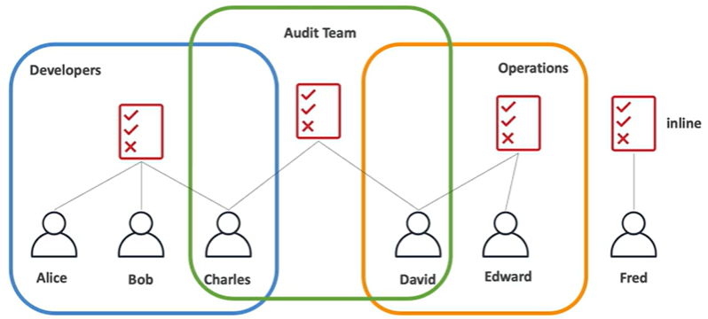

# IAM Policies

An **inline policy** is a policy that is only attached to a user.



## IAM Policy Structure

A IAM policy structure consists of:
- **version number** (required)
- **identifier** (optional)
- **statement** (required)
    - **sid**: identifier for the statement (optional)
    - **effect**: whether the statement allows or denies access (Allow, Deny)
    - **principal**: account/user/role to witch this policy applied to (optional)
    - **actions**: list of actions this policy allows or denies (required)
    - **resources**: list of resources to which the actions applied to
    - **condition**: conditions for when this policy is in effect (optional)

### Example: AdministratorAccess Policy

Provides full access to AWS services and resources.

```
{
    "Version": "2012-10-17",
    "Statement": [
        {
            "Effect": "Allow",
            "Action": "*",
            "Resource": "*"
        }
    ]
}
```

### Example: IAMReadOnlyAccess Policy

Provides read only access to IAM via the AWS Management Console.

```
{
    "Version": "2012-10-17",
    "Statement": [
        {
            "Effect": "Allow",
            "Action": [
                "iam:GenerateCredentialReport",
                "iam:GenerateServiceLastAccessedDetails",
                "iam:Get*",
                "iam:List*",
                "iam:SimulateCustomPolicy",
                "iam:SimulatePrincipalPolicy"
            ],
            "Resource": "*"
        }
    ]
}
```
