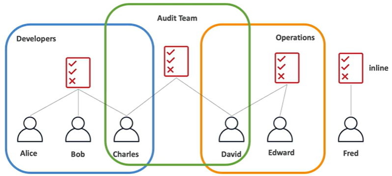
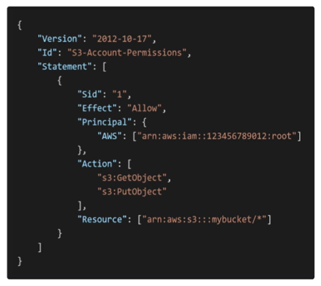

# IAM Policies

An **inline policy** is a policy that is only attached to a user.

## IAM Policy Structure

A IAM policy structure consists of:
- **version number** (required)
- **identifier** (optional)
- **statements** (required)
    - **sid**: identifier for the statement (optional)
    - **effect**: whether the statement allows or denies access (Allow, Deny)
    - **principal**: account/user/role to witch this policy applied to
    - **actions**: list of actions this policy allows or denies
    - **resources**: list of resources to which the actions applied to
    - **condition**: conditions for when this policy is in effect (optional)

