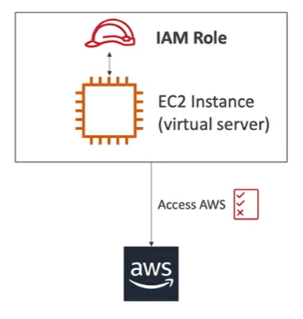

# IAM Roles

Some AWS services need to perform actions on your behalf. To do so, we use what's called an **IAM Role**. 

A IAM ROLE is just like a user, but it is intended to be used not by physical people, but instead it will be used by AWS services.

In simple terms, a role is a way to give AWS entities permissions to do stuff on AWS.

Common roles:
- EC2 Instance Roles
- Lamba Function Roles
- CloudFormation Roles

