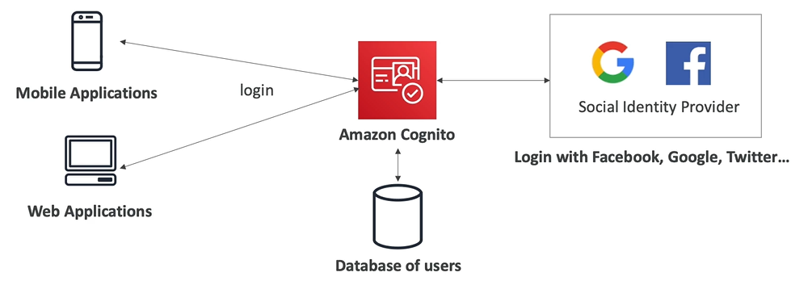

# AWS Cognito

- AWS Cognito is a way to **provide identity for your web and mobile applications users** (potentially millions)
- IAM users are only for the people who belong to your company and need to use AWS directly
- AWS Cognito has its own internal database of users

