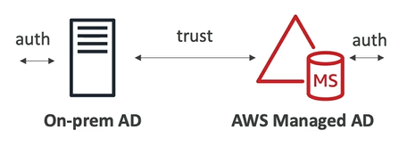
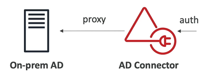

# AWS Directory Service

- **AWS Managed Microsoft AD**:
    - Create your own AD in AWS, manage users locally, supports MFA
    - Establish "trust" connections with your on-premise AD

    

- **AD Connector**
    - Directory Gateway (proxy) to redicted to on-premise AD, supports MFA
    - Users are managed on the on-premise AD

    

- **Simple AD**
    - AD compatible managed directory on AWS
    - Cannot be joined with on-premise AD
    
    

## Microsoft Active Directory (AD)

- Microsoft Active Directory (AD) is found on any Windows Server with AD Domain Services
- Microsoft Active Directory (AD) is a **database of objects**:
    - Users
    - Accounts
    - Computers
    - Printers
    - File Shares
    - Security Groups
- Microsoft Active Directory (AD) allows you to:
    - Centralized security management
    - Create account
    - Assign permissions