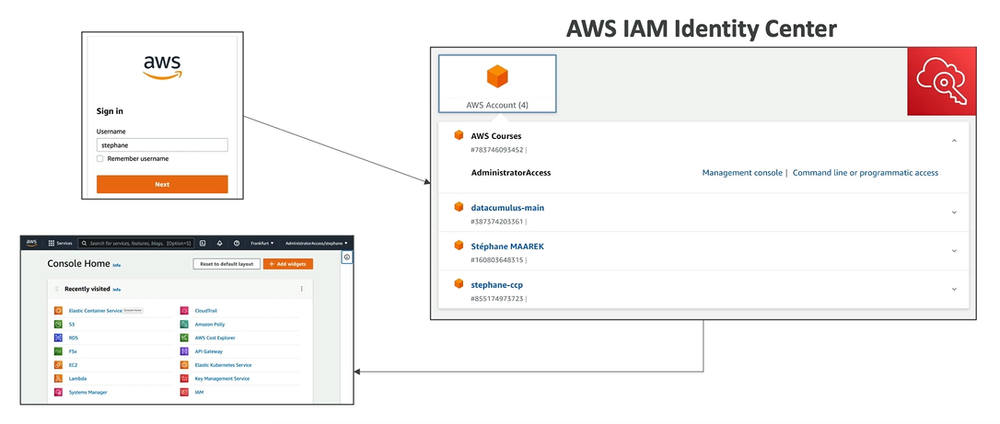

# AWS IAM Identity Center

- AWS IAM Identity Center is the successor to AWS Single Sign-On
- **One login (single sign-on)** for all your
    - **AWS accounts in AWS organizations**
    - Business cloud applications (e.g. Saleforce, Box, Microfosft 365, etc.)
    - SAML2.0-enabled applications
    - EC2 Windows Instances

- Identity provides
    - Built-in identity sotre in IAM Identity Center
    - 3rd parties: Active Directory (AD), OneLogin, Okta, etc.

## Login Flow

