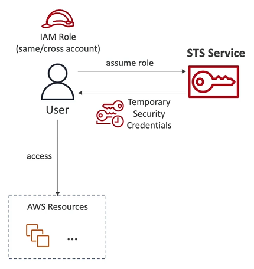

# Security Token Service (STS)

- Security Token Service (STS) enables you to create **temporary, limited-privileges credentials** to access your AWS resources
- Short-term credentials (you configure expiration period)
- Use cases:
    - **Identity Federation**: manage user identities in external systems, and provide them with STS token to access AWS resources
    - **IAM Roles for cross/same account access**
    - **IAM Roles for Amazon EC2**: provide temporary credentials for EC2 instances to access AWS resources

