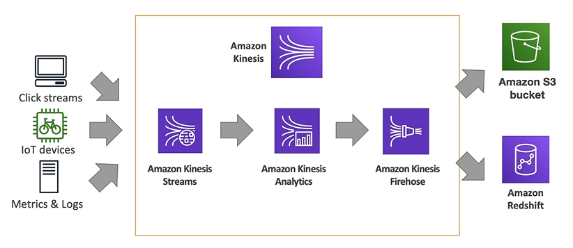

# Kinesis Basics

- Kinesis = real-time big data streaming
- Managed service to collect, process, and analyze real-time streaming data at any scale

Sub-services:

- **Kinesis Data Stream**: low latency streaming to ingest data at scale from hundreds of thousands of sources (e.g. a truck, a boat, an IoT device, etc.)
- **Kinesis Data Firehose**: load streams into S3, Redshift, ElasticSearch, etc.
- **Kinesis Data Analytics**: perform real-time analytics on streams using SQL 
- **Kinesis Video Streams**: monitor real-time video streams for analytics or ML

