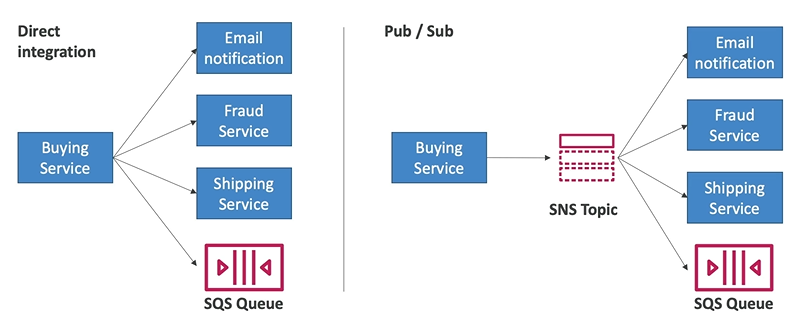

# SNS Basics

What if you want to send in message to many receivers?

- SNS stands for **Simple Notification Service**
- Event publishers only sends message to one SNS topic
- Event subscribers listen to the SNS topic notifications (as many as we want)
- Each subscriber to the topic **will get any messages**
    - This is different from SQS where the consumers share the messages

SNS has many destinations (i.e. it can publish to many subscribers):
- SQS
- Lambda
- Kinesis Data Fiehose
- Emails
- SMS & Mobile Notifications
- HTTP(S) endpoints