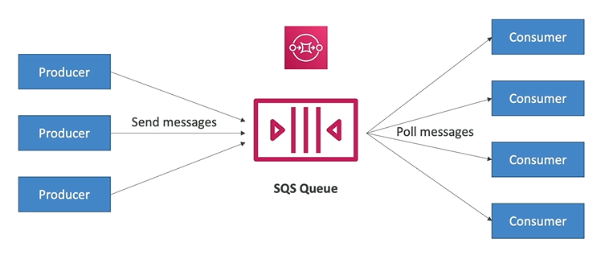
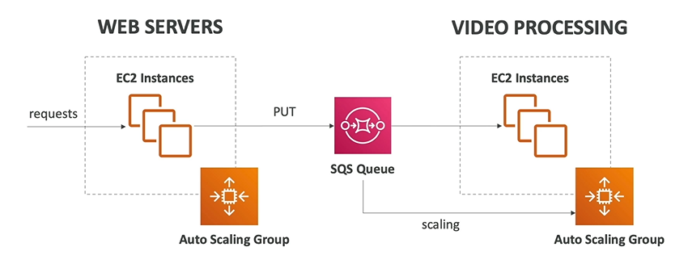

# SQS Basics

- SQS stands for **Simple Queue Service**
- Oldest AWS Offering (10 years old)
- Fully managed service (serverless) 
- Used to decouple applications
- Scale seamlessly (from 1 message per second to 10K per second)
- Default retention of message is 4 days (maximum of 14 days)
- No limit how many messages can be in the queue
- **Messages are deleted after they are read from the consumers**
- Low latency (<10ms on publish and receive)
- Consumers share the work to read message & scale horizontally

## SQS to decouple betwen application tiers

In this scenario there are two layers, the web servers and the video processing, fully decoupled from the SQS queue and scaling independently.

## SQS FIFO Queues

When you have a normal SQS queue consumers can read messages altogether and they could be in different orders.

With Amazon **SQS FIFO queues** the message are going to be in order. So if you have a producer sending messages in a specific order then the consumer will also read these messages in order.

