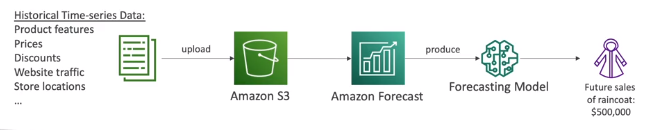

# AWS Forecast

- AWS Forecast is a fully managed service that **uses ML to deliver highly accurate forecasts**
- Example: predict the future sales of a raincoat
- 50% more accurate that looking at the data itself
- Reduce forecasting time from months to hours
- Use cases:
    - Product Demand Planning
    - Financial Planning
    - Resource Planning

