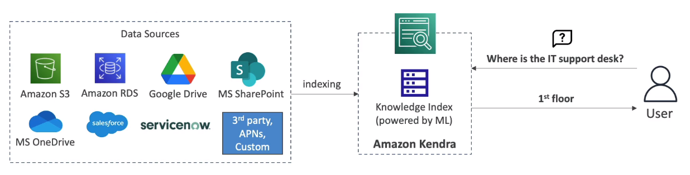

# AWS Kendra

- AWS Kendra is a fully managed **document search service** powered by ML
- Extract answers from within a document (text, pdf, html, powerpoint, word, faqs, etc.)
- Natural language search capabilities
- Learn from  user interactions/feedback to promote preferred results (incremental learning)
- Ability to manually fine-tune search results (importance of data, freshness, custom, etc.)

