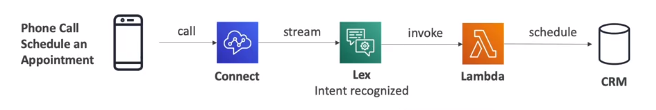

# AWS Lex and Connect

- AWS Lex is the same **technology that powers Alexa** devices
    - Automatic Speech Recognition (ASR) to convert speech to text
    - Natural Language Understanding to recognize the intent of text, callers
    - Helps build chatbots and call center bots
- AWS Connect is a **cloud-based visual contact center**
    - Receive calls, create contact flows
    - Integrate with other CRM systems or AWS
    - No upfront payments, 80% cheaper than traditional contact center solutions

