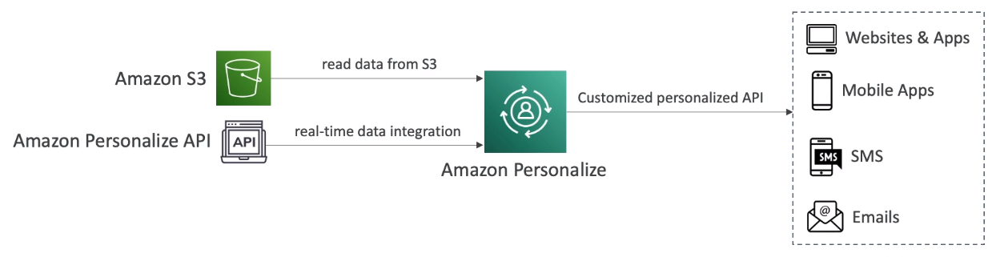

# AWS Personalize

- AWS Personalize is a fully machine learning service **to build apps with real-time personalized recommendations**
- Example: personalized product recommendations/re-ranking, customized direct marketing
- Same technology **used by Amazon.com**
- Integrates into existing websites, applications, SMS, email marketing systems, etc.
- Implement in days, not month (you don't need to build, train, and deploy ML solutions)
- Use cases:
    - Retail stores
    - Media and entertainment
    - Etc.

