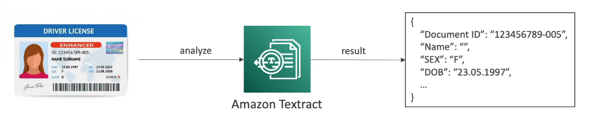

# AWS Textract

- AWS Textract is a service that automatically **extracts text, handwriting, and data from any scanned documents** using AI and ML
- Extract data from forms and tables
- Read and process any type of document (PDFs, images, etc.)
- Use cases:
    - Financial Services (e.g. invoices, financial reports, etc.)
    - Healthcare (e.g. medical records, insurance claims, etc.)
    - Public Sector (e.g. tax forms, ID documents, passports, etc.)

