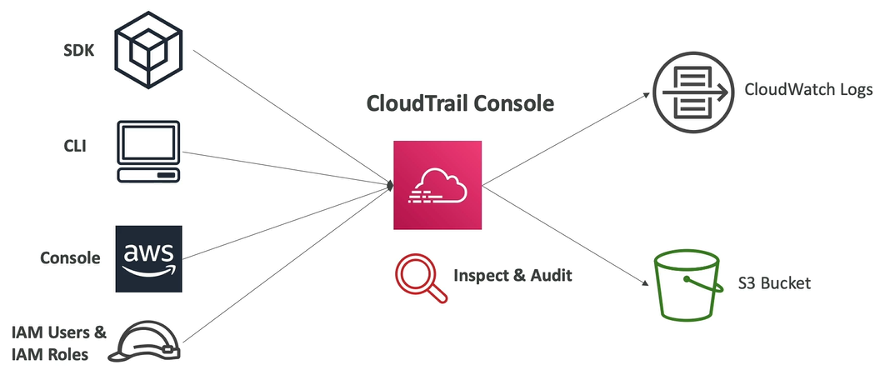

# CloudTrail

- It provides governance, compliance and audit for you AWS account
- CloudTrail is **enabled by default**!
- Get an history of events/API-calls made within your AWS account by:
    - Console
    - SDK
    - CLI
    - AWS Services
- Can put logs from CloudTrail into CloudWatch Logs or S3 (long term retention of data)
- A trail can be applied to All Regions (default) or a Single Region
- **If a resource is deleted in AWS, investigate CloudTrail first!**

## CloudTrail Insights

AWS CloudTrail Insights helps AWS users identify and respond to unusual activity associated with API calls and API error rates by continuously analyzing CloudTrail management events. CloudTrail Insights analyzes your normal patterns of API call volume and API error rates, also called the baseline, and generates Insights events when the call volume or error rates are outside normal patterns.

