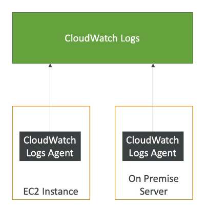

# CloudWatch

Amazon CloudWatch monitors your Amazon Web Services (AWS) resources and the applications you run on AWS in real time.

## CloudWatch Metrics

- CloudWatch provides **metrics** form **every** services in AWS
- A metric is a **variable to monitor** (CPU Usage, Network, etc.)
- Metrics have timestamps
- Can create CloudWatch dashboards of metrics

Important Metrics:
- **EC2 instances**: CPU Utilization, Status Checks, Network (not RAM)
    - Default metrics every 5 minutes
    - Option for Detailed Monitoring ($$$): metrics every 1 minute
- **EBS volumes**: Disk Reads/Writes
- **S3 buckets**: Bucket Size Bytes, Number of Objects, All Requests
- **Billing**: Totale Estimated Charge (only us-east-1)
- **Service limits**: How much you have been using a service API
- **Custom metrics**: Push you own metrics

## CloudWatch Alarms

- Alarms are use to trigger notifications for any metric
- Once a metric goes above a threshold we can have an **action**
    - Auto Scaling: increase or decrease EC2 instance
    - EC2 Actions: stop, terminate, reboot or recover and EC2 instance
    - SNS notifications: send a notification into a SNS topic
- Various options (ercentage, max, min, etc.)
- Can choose the period on which to evaluate an alarm
- Alarm States:
    - **OK**: everything is good
    - **INSUFFICIENT_DATA**: there is not enough data points to figure out if good or bad
    - **ALARM**: when it is bad

## CloudWatch Logs

- CloudWatch Logs can collect log from:
    - ElasticBeanstalk: collection of logs from application
    - ECS: collection from containers
    - Lamba: collection from function logs
    - CloudTrail based on filter
    - CloudWatch log agents: on EC2 machines or on-premises servers
    - Route53: Log DNS queries
- Enables real-time monitoring of logs
- Adjustable CloudWatch Logs retention

## CloudWatch Logs for EC2

- By default, no logs from you EC2 instance will go to the CloudWatch
- You need to run a CloudWatch agent on EC2 to push the log files you want
- Make sure IAM permissions are correct
- The CloudWatch log agent can be setup on-premises too

