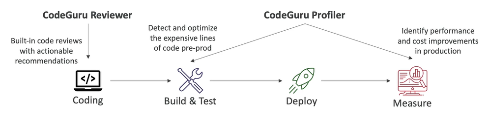

# CodeGuru Basics

- ML-powered service for **automated code reviews** and **application performance reccomendations**
- Provides two functionalities:
    - **CodeGuru Reviewer**: automated code reviews for static code analysys (development)
    - **CodeGuru Profiler**: visibility/recommendations about application performance during runtime (production)

## CodeGuru Reviewer

- **Identify critical issues, security vulnerabilities, and hard-to-find bugs**
- Example: common coding best practices, resource leaks, security detection, input validation
- Uses Machine Learning and automated reasoning
- Hard-learned lessons across millions of code reviews on 1000s of open-source and Amazon repositories
- Supports Java and Python
- Integrates with GitHub, BitBucket and AWS CodeCommit

## CodeGuru Profiler

- **Help understand the runtime behaviour of your application**
- Example: identify if your application is consuming excessive CPU capacity on a logging routine
- Features:
    - Identify and remove code inefficiencies
    - Improve application performance (e.g. reduce CPU utilization)
    - Decrese compute costs
    - Provides heap summary (identify which objects using up memory)
    - Anomaly Detection
- Supports applications running on AWS or on-premises
- Minimal overhead on application

