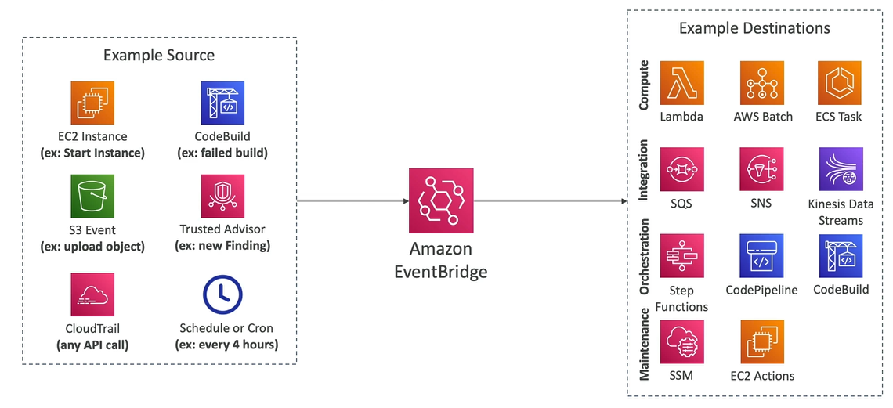

# EventBridge Basics (formerly CloudWatch Events)

With AWS EventBridge you can react to events happening within your AWS accounts.

Use cases:
- **Schedule**: Cron Jobs (serverless cron job)
    - e.g. You can trigger a script running on a Lambda function every one hour 
- **Event Pattern**: Event rules to react to a service doing something
    - e.g. You wanted to give alerts to your security team whenever someone is going to log in using the root user

Destinations (o Target APIs):
- Trigger Lambda functions
- Send SQS/SNS messages
- etc.

## EventBridge Capabilities

- **Default Event Bus** (AWS Services)
- **Partner Event Bus** (AWS SaaS Partners)
- **Custom Event Bus** (Custom Apps)
- **Schema Registry**: model event schema
- Ability to **archive events** (all/filter) sent to an event bus (indefinitely or set period)
- Ability to **replay archived events**

## EventBridge Rule Examples

