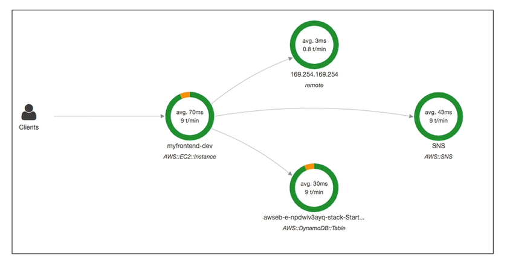

# X-Ray Basics

- Debugging in Production ("the good old way")
    - Test locally
    - Add log statements everywhere
    - Re-deploy in production
- Log formats differ accross applications and log analysis is hard
- Debugging one big monolith is "easy"
- Debugging distributed services are "hard" (no common views of your architecture)

With AWS X-Ray you get **tracing** and **visual analysis** of your application.

## X-Ray advantages:

- Troubleshooting performance (bottlenecks)
- Undestand dependencies in a microservice architecture
- Pinpoint sservice issues
- Review request behavior
- Find errors and exceptions
- Are me meeting time SLA?
- Where I am throttled?
- Identify users that are impacted

