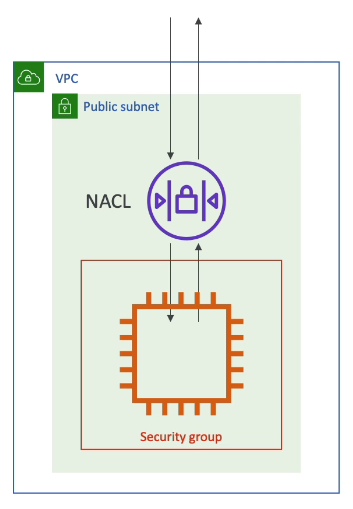
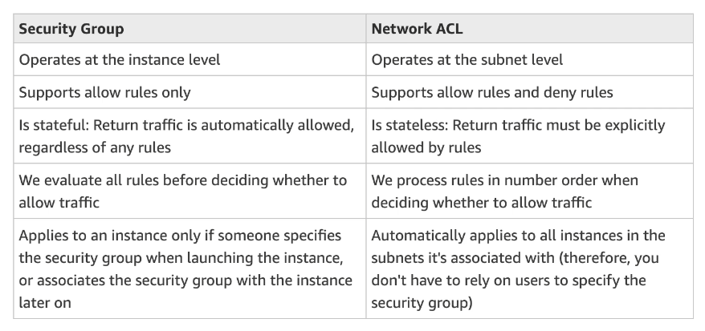

# Network ACLs and Security Groups

Two lines of defense:
- **Network ACLs (NACLs)** (subnet level)
    - A firewall that controls traffic from and to subnet (before it reaches our resources)
    - Can have ALLOW and DENY rules
    - Are attached to the **subnet level**
    - Rules only include IP addresses
- **Security Groups** (instance level)
    - A firewall that controls traffic to and from an **Elastic Network Interface (ENI)** or an **EC2 Instance**
    - Can have only ALLOW rules
    - Rules include IP addresses and other security groups
    

## Network ACLs vs Security Groups

