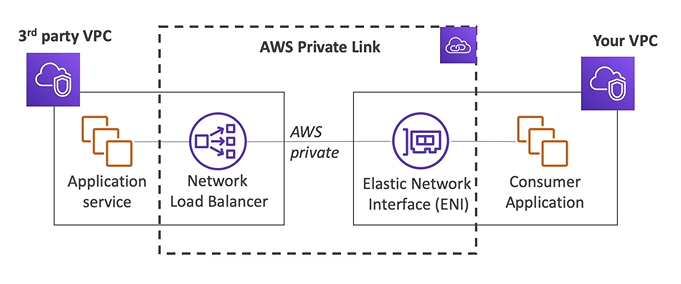

# PrivateLink (VPC Endpoint Services)

- Most secure & scalable ways to expose a service to 1000s of VPCs
- Does not require VPC peering, Internet Gateway, NAT, route tables, etc.
- Requires a **Network Load Balancer** (3rd Service VPC)
- Requires an **Elastic Network Interface** (Customer VPC)
- All the internet traffic **do not go through the public internet**, but through your private network

