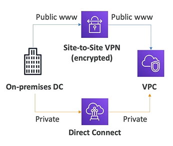
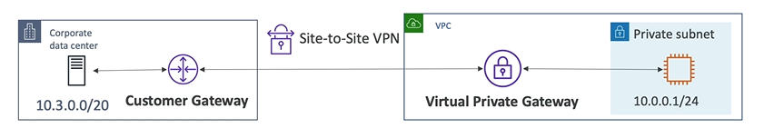

# Site to Site VPN

Two options to connect AWS to your data center:
- **Site to Site VPN**
    - Connect an on-premise VPN to AWS
    - The connection is automatically encrypted
    - Goes over **public internet**
    - Limited bandwith and security concerns
    - Takes *five minutes* to establish
- **Direct Connect (DX)**
    - Establish a **physical connection** between on-premises and AWS
    - The connection is private, secure and fast
    - Goes over **private network**
    - More expensive 
    - Takes *at least a month* to establish

## Site to Site VPN

- On-premises: must use a **Customer Gateway (CGW)**
- AWS: must use a **Virtual Private Gateway (VGW)**

