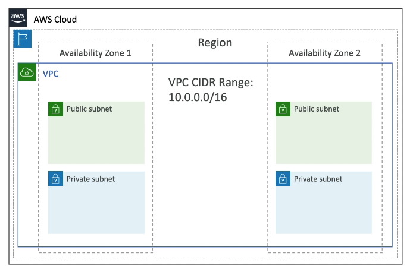
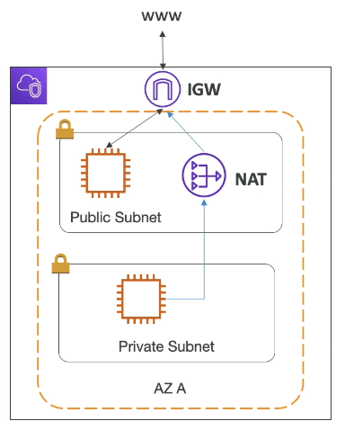

# VPC

VPC stands for **Virtual Private Cloud**.

## IP Addresses in AWS

- **IPv4: Internet Protocol version 4** (4.3 Billion addresses)
    - **Public IPv4** can be used on the Internet
        - EC2 instance gets a new a public IP address every time you stop then start it (default)
    - **Private IPv4** can be used on private networks (LAN) such as internal ASW networking (e.g. 192.168.1.1)
        - Private IPv4 is fixed for EC2 instaces even if you start/stop them
- **Elastic IP**: allows you to attach a fixed public IPv4 address to EC2 instance (it will cost you!)
    - **Note**: It has ongoing cost if not attached to EC2 instance or if the EC2 instance is stopped (because AWS needs to pay to keep that public IP alive and within its own network.)
- **IPv6: Internet Protocol version 6** (3.4 * 10³⁸ addresses)
    - **Every IP address is public (no private range)**
    - Example: 2001:db8:3333:4444:cccc:dddd:eeee:ffff

## VPC & Subnets

- VPC is a **private network cloud** to deploy your resources 
    - A VPC is linked to a specific region (regional resource)
- **Subnets** allow you to partition your network inside your VPC 
    - A subnet is linked to an availability zone (AZ resource)
    - A **public subnet** is accessible from the internet
    - A **private subnet** is not accessibile from the internet
- To define access to the internet and between subnets we use **Route Tables**

## Internet Gateway & NAT Gateway

- **Internet Gateways** allow VPC instances to connect with the internet
    - Public Subnets have a route to the Internet Gateway
    - A VCP can **only have one** Internet Gateway
- **NAT Gateways** (AWS-managed) & **NAT Instances** (self-managed) allow your instances in your Private Subnets to access the internet while remaining private (e.g. software updates)

## NAT Gateway Example 

How to allow private subnets to get internet connectivity ? 

1. Create a NAT Gateway (or Nat Instance) in the public subnet
2. Ceate a route from the private subnets to the NAT Gateway
3. Create a route from the NAT Gateway to the Internet Gateway

## VPC Flow Logs

- Capture information about IP traffic going into your interfaces:
    - VPC Flow Logs
    - Subnet Flow Logs
    - Elastic Network Interface (ENI) Flow Logs
- Help to **monitor & troubleshoot connectivity issues**
    - e.g. a subnet cannot connect to internet
    - e.g. a subnet cannot connect to another subnet
    - e.g. internet cannot access a subnet
- Capture network information from AWS managed interfaces:
    - Elastic Load Balancers
    - ElastiCache
    - RDS
    - Aurora
    - Etc.
- VPC Flow Logs can go to S3, CloudWatch Logs, and Kinesis Data Firehose