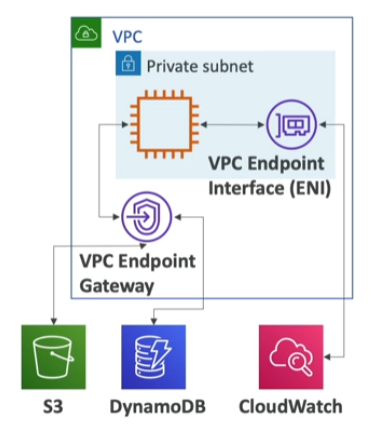

# VPC Endpoints

- All the AWS services are **public**, when we connect to them, we are connecting to them publicly
- Endpoints allow you to connect AWS services using a **private network** instead of the public www network
- This gives you **enhanced security** and **lower latency** to access AWS services

Two types of VPC Endpoints:
- **VPC Endpoint Gateway**: S3 and DynamoDB
- **VPC Endpoint Interface**: the rest

