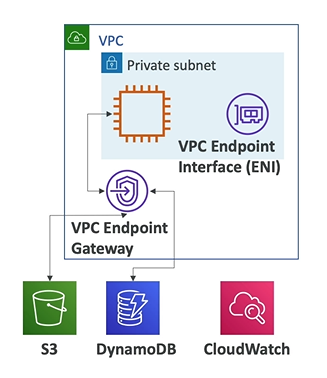
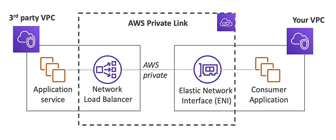

# VPC Endpoints Basics

- All the AWS services are **public**, when we connect to them, we are connecting to them publicly
- Endpoints allow you to connect AWS services using a private network instead of the public www network
- This gives you **enhanced security** and **lower latency** to access AWS services

Two types of VPC Endpoints:
- **VPC Endpoint Gateway**: S3 and DynamoDB
- **VPC Endpoint Interface**: the rest

## AWS Private Link (VPC Endpoint Services)

- Most secure & scalable ways to expose a service to 1000s of VPCs
- Does not require VPC peering, internet gateway, NAT, route tables, etc.
- Requires a **network load balancer** (Service VPC) and an **elastic network interface** (Customer VPC)
- And all the internet traffic do not go through the public internet, but through your private network

