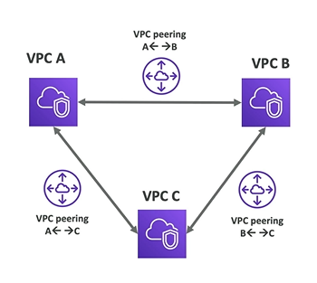

# VPC Peering Basics

- Connect two VPC privately using AWS network
- Make them behave as if they were in the same network
- Must not have overlapping CIDR (IP addresses range)
- VPC peering connection **is not transitive** (must be enabled for each VPC that need to comunicate with one another)

