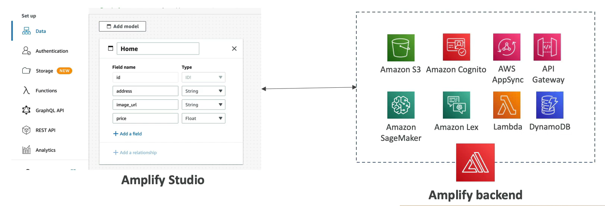

# AWS Amplify

- Amplify is a set ot tools and services that helps you develop and deploy scalable full stack web and mobile applications
- Amplify is a *good wrapper* around all these services:
    - Authentication
    - Storage
    - API (Rest or GraphQL)
    - CI/CD
    - PubSub
    - Analytics
    - AI/ML Predictions
    - Monitoring
    - Source Code from AWS
    - Github
    - etc.
- A sort of *Elastic Beanstalk for mobile and web applications*

