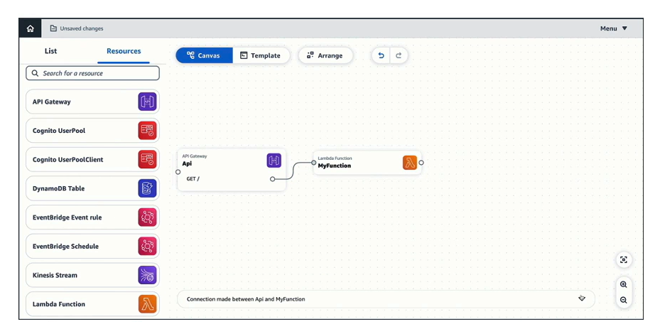

# AWS Application Composer

- Visually design and build serverless applications quickly on AWS
- Deploy AWS infrastructure code without needing to be an expert in AWS
- Configure how your resources interact with each other
- Generates Infrastructure as Code (IaC) for CloudFormation
- Ability to import existing CloudFormation/SAM* templates to visalize them

*Serverless Application Model (SAM)

