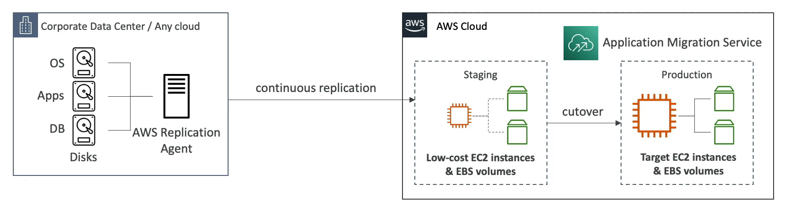

# AWS Application Migration Service (MGN)

- The evolution of *CloudEndure Migration*
- Lift-and-shift (rehost) solution which simplify **migrating** application to AWS
- Convert your physical, virtual, and cloud-based servers to run natively on AWS
- Supports wide range of plafforms, Operating Systems, and database
- Minimal downtime, reduced costs

