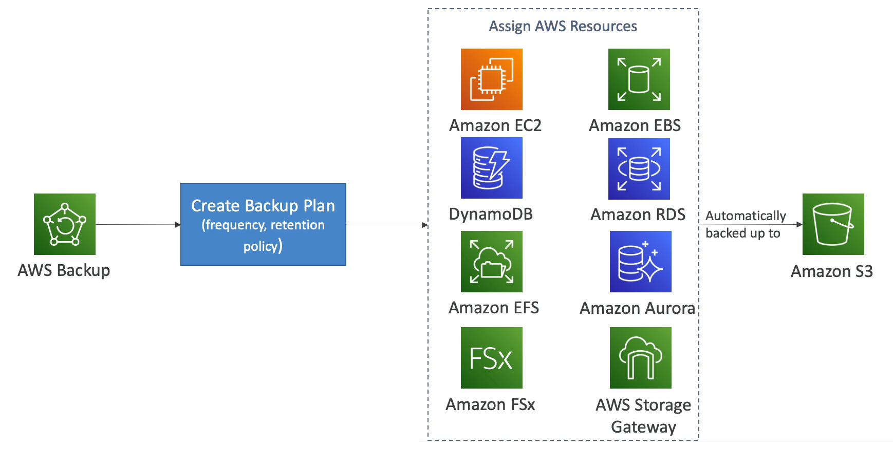

# AWS Backup

- Fully managed service to centrally manage and automate backups across AWS services
- On-demand and scheduled backups
- Supports Point-in-Time Recovery (PITR)
- Retention Period, Lifecycle Management, Backup Policies, etc.
- Cross-Region Backup
- Cross-Account Backup (using AWS Organizations)

