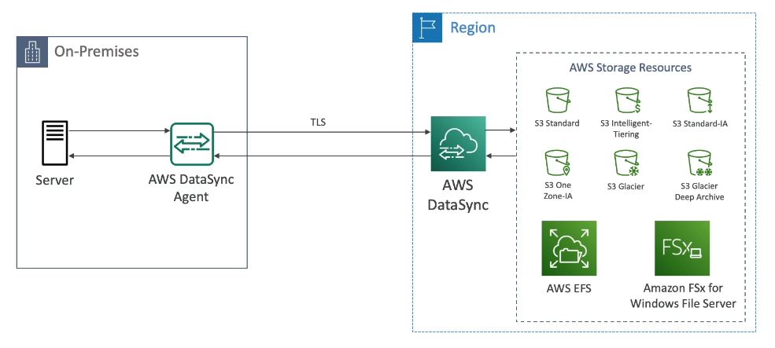

# AWS DataSync

- Move large amount of data from on-premises to AWS
- Can syncronize to:
    - S3 (any storage classes including Glacier)
    - EFS
    - FSx for Windows
- Replication tasks can be scheduler hourly, daily, weekly
- Replication tasks are **incremental after the first full load**

