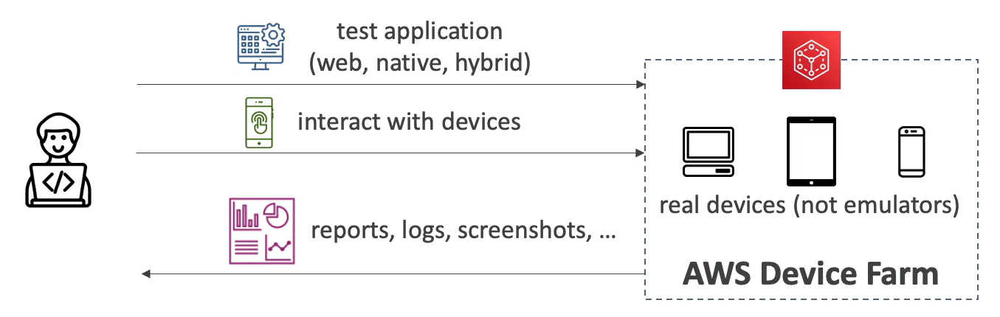

# AWS Device Farm

- Fully managed service that test your web and mobile apps against desktop browser, **real** mobile devices, and tablets
- Run test concurrently on multiple devices (speed up execution)
- Ability to configure device settings (GPS, language, Wi-Fi, Bluetooth, etc.)

