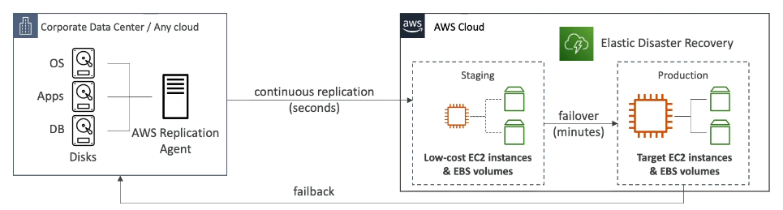

# AWS Elastic Disaster Recovery (DRS)

- Used to be named *CloudEndure Disaster Recovery*
- Quickly and easily **recover** your physical, virtual, and cloud-based servers into AWS
- **Continuos block-level replication** for your servers
- Example:
    - protect critical database (including Oracle, MySQL, and SQL Server)
    - protect enterprise app (SAP)
    - protect your data from ransomware attacks
    - etc.
    

