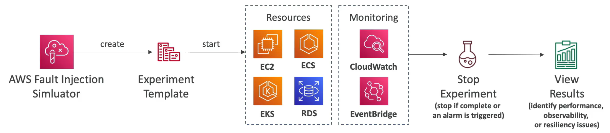

# AWS Fault Injection Simulator (FIS)

- A fully managed service for running fault injection experiments on AWS workloads
- Bases on **Chaos Engineering**: stressing an application by creating disruptive events (e.g. sudden increase in CPU or memory), observing how the system responds, and implementing improvements
- Helps you uncover hidden bugs and performance bottlenecks
- Supports the following services: EC2, ECS, EKS, RDS, etc.
- Use pre-builts templates that generate the desired disruptions

