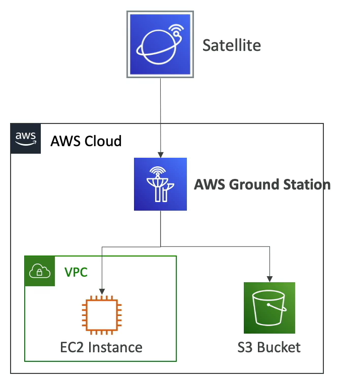

# AWS Ground Station

- Fully managed service that lets you control satellite communications, process data, and scale your satellite operations
- Provide a global network of satellite ground stations near AWS regions
- Allows you to download satellite data to your AWS VPC within seconds
- Send satellite data to S3 or EC2 instances
- Uses cases: weather forecasting, surface imaging, communications, video broadcast

