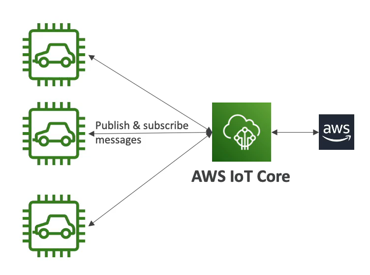

# AWS IoT Core

- IoT stands for **Internet of Things**
- IoT is the network of internet-connected devices that are able to collect and transfer data
- IoT Core allows you to **easily connect IoT devices to AWS Cloud**
- **Serverless, secure, and scalable** to billions od devices and trillions of messages
- Your application can communicate with your devices even when they aren't connected
- Integrates with a lot of AWS services (Lambda, S3, SageMaker, etc.)
- Build IoT applications that gather, process, analyze, and act on data

