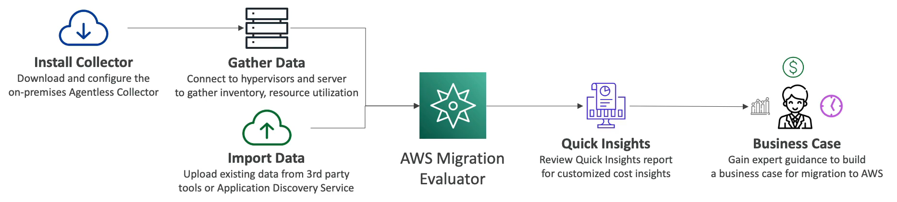

# AWS Migration Evaluator

- Formerly **TSO Logic**
- Helps yout to build a data-driven business case for migration to AWS
- Provides a clear baseline of what your organization is running today
- Install Agentless Collector to conduct broad-based discovery of infrastructure
- Take a snapshot of on-premises foot-print, server dependencies, etc.
- Analyze current state, define target state, them develop migration plan

