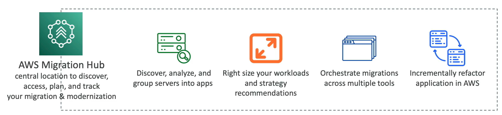

# AWS Migration Hub

- Central location to collect servers and applications inventory data for the assessment, planning, and tracking of migrations to AWS
- Helps accelerate migration to AWS, automate lift-and-shift
- **AWS Migration Hub Orchestrator** provides pre-built templates to save time and effort migrating enterprise apps (e.g. SAP, Microsoft SQL Server, etc.)
- Supports migrations status updates from:
    - Application Migration Service (MGN)
    - Database Migration Service (DMS)
    
