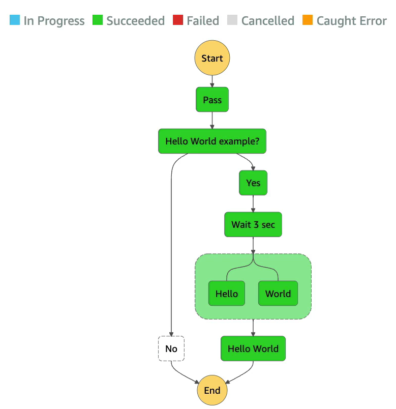

# AWS Step Functions

- Build serverless visual workflow to orchestrate your Lambda functions
- Features: sequence, parallel, conditions, timeouts, error handling, etc.
- Can integrate with EC2, ECS, On-premises servers, API Gateway, SQS queues, etc.
- Possibility of implementing human approval feature
- Use cases:
    - Order fulfillment
    - Data processing
    - Web applications
    - Etc.
    
