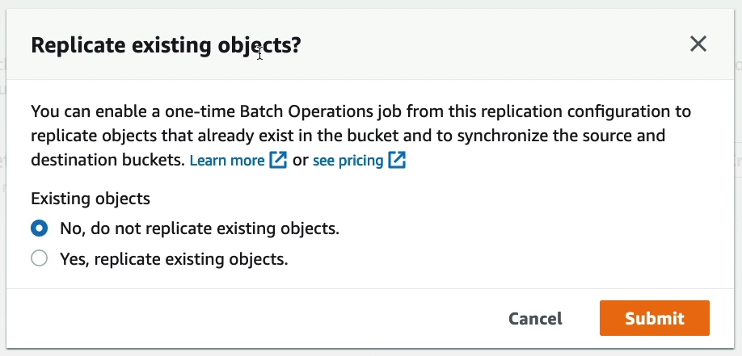

# S3 Replication

The idea of **S3 Replication** is that we have a source S3 Bucket and a target S3 and we want to set up **asynchronous replication** between these two buckets.

S3 Replication supports:
- Cross-Region Replication (CRR)
- Same-Region Replication (SRR)

Notes:

- S3 Versioning must be enabled in target and source bucket
- S3 Buckets can be in different AWS accounts
- Copying is asynchronous
- Must give proper IAM permission to S3

Use Case:
- CRR: compliance, lower latency, replication across accounts
- SRR: log aggregation, live replication between production and tests accounts

## Replication Rule

When you enable replication, it will only replicate objects from the moment you set it (i.e. newer uploads). If you want to replicate the previous objects from the source of the destination bucket, you could use something called a **Batch Operation**, but this is separate from the replication feature itself.

