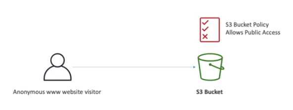

# S3 Security

- **User-Based**
    - IAM Policies: which API calls should be allowed for a specific user from IAM
- **Resource-Based**
    - Bucket Policies: bucket-wide rules from the S3 console (allows cross account)
    - Object Access Control List (ACL): finer grain (can be disabled)
    - Bucket Access Control List (ACL): less common (can be disabled)

An IAM Principal can access an S3 object if:
- the user IAM permissions ALLOW it **OR** the resource policy ALLOWS it
- **AND** there is no explicit DENY

Another way to do security on S3 is to encrypt the objects using encryption keys.

## S3 Bucket Policies

JSON based policies
- Resources: buckets and objects
- Effect: allow or deny
- Actions: set of API to Allow or Deny
- Principal: the account or user to apply the policy to

Use S3 bucket for policy to:
- grant public access to bucket
- force objects to be encrypted at upload
- grant access to another account (cross account)

~~~
{
    "Id": "Policy170179458798",
    "Version": "2012-10-17",
    "Statement": [
        {
            "Sid": "Stmt1701887876128",
            "Action": [
                "s3:GetObject"
            ],
            "Effect": "Allow",
            "Resource": "arn:aws:s3:::demo-s3/*",
            "Principal": "*"
        }
    ]
}
~~~

## Buckets settings for Block Public Access

These settings were invented by AWS as an extra layer of security to prevent data leaks.

So even though you would set an S3 Bucket Policy that would make it public, if these settings are enabled, the bucket will never be public. 

If you know your bucket should never be public, leave these settings on.

If you know that none of your S3 buckets ever should be public, then you can set this at the account level.

## Examples

Example: Public Access - Bucket Policy

Example: IAM Access to S3 - IAM Policy

Example: EC2 instance access - IAM Roles

Example: Cross-Account Access - Bucket Policy

